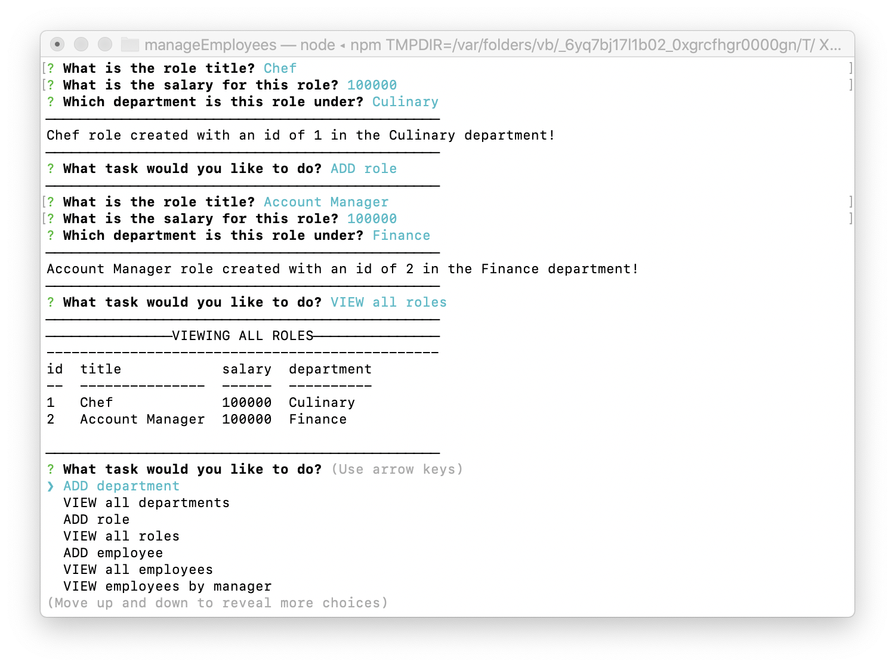
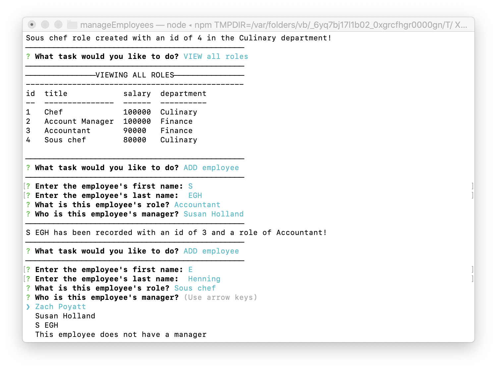
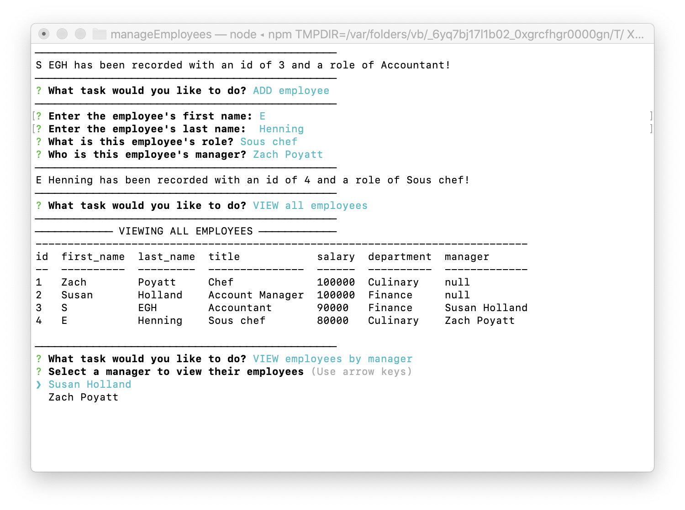
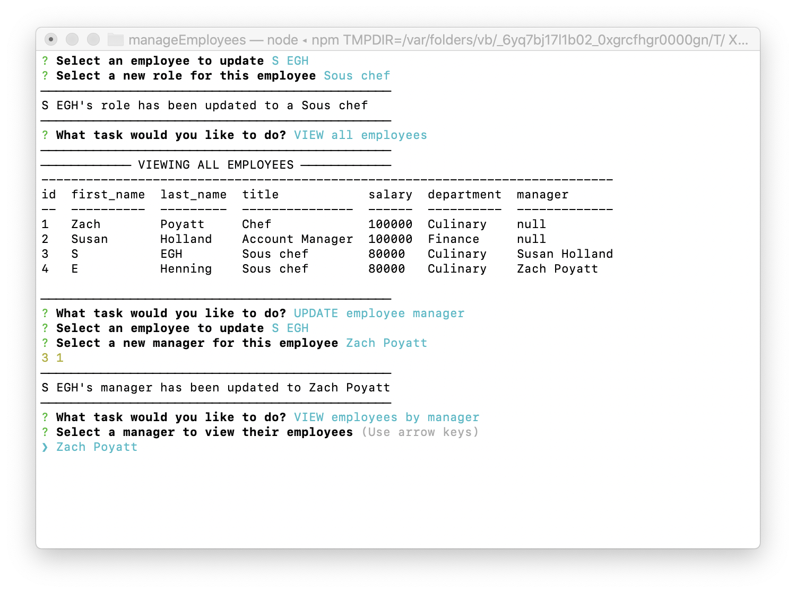

# manageEmployees

  [](http://unlicense.org/)

  ## Description
  This is an app that runs in the CLI, connects to a employee SQL database, and uses Inquirer prompts to enable a user to add, view, and update data in three tables (department, role, employee) that are related through foreign keys.

  ## Table of Contents
  * [Installation](#installation)
  * [Usage](#usage)
  * [License](#license)
  * [Contributing](#contributing)
  * [Tests](#tests)
  * [Questions](#questions)

  ## Installation
  After cloning this repository, the user should run ```npm install``` in their terminal to install necessary dependencies for this application. A schema is included in the repository that can be used to create the inital database.

  ## Usage
  * The app can be run with either ```npm start``` or ```node manageEmployees.js```
  * When opening the app for the first time, the user is greeted and prompted to enter a department

  

  * Once departments exist in the database, this prompt menu is given upon opening the app

  

  * After their first department is created the user is given a list prompt menu of task choices
  
  

  * When tasks cannot be completed due to relevant data not yet in database, the user will see the following responses and be taken back to the main menu

    

  * When adding a role, the user is prompted for title and salary input and to select a department from list of department names

  

  * When viewing roles, the user is given data from the role table as well as referenced data from the department table

  

  * When adding an employee, the user is prompted for first and last name input, to select a role from a list of current roles, and to select the employee's manager's name from a list of current employees names, or "This employee does not have a manager" if none

  

  * When creating the first employee, the only option for the employee's manager is "This employee does not have a manager"

  

  * Once there is at least one employee, the prompt lists all the employees in the database as choices for the employee's manager

  

  * When viewing employees the user is given data from the employee table, as well as referenced data from the role and department tables

  

  * When viewing employees by manager the user is prompted to select from a list of employees who are referenced as managers and the employees who are assigned to them are displayed

    

  * To update an employee's role, the user can select a name from a list of all employees, then select a role title from a list of current roles in the database. Selecting a new role will update the employee's correlated salary and department as well.

  

  * To update an employee's manager, the user can select a name from a list of all employees, then select their new manager's name from a list of all employee names, excluding the employee being updated

    
    


  * To remove an employee the user selects an employee's name from a prompt list and they are removed

    

  * Selecting EXIT from the main menu closes the app
  
  

  * See more usage descriptions in videos [one](https://drive.google.com/file/d/1lI9_niuCyodKCn8hVM2vfbJunTK877FQ/view?usp=sharing) and [two](https://drive.google.com/file/d/1lI9_niuCyodKCn8hVM2vfbJunTK877FQ/view?usp=sharing)

  ## License
  Licensed under the Unlicense license.

  ## Contributing
  Please follow the Contributor Covenant guidelines when contributing to this project.

  ## Tests
  Testing for this app will be a feature added inthe future.

  ## Questions
  Please contact me with any questions through my GitHub profile [SEGH](https://github.com/SEGH) or [email](mailto:segh@fastmail.com)
